# raylib technologies

We develop custom software tools and technology. Multiplatform, high-performant and pipeline-ready.

## raylibtech tools

<table border="0">
    <tbody style="border: none;">
        <!-- Row 1 -->
        <tr>
            <td style="border: none;"><a href="https://raylibtech.itch.io/rtexviewer">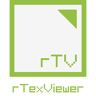</a></td>
            <td style="border: none;"><a href="https://raylibtech.itch.io/rtexpacker">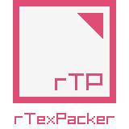</a></td>
            <td style="border: none;">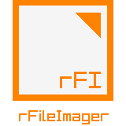</a></td>
            <td style="border: none;"><a href="https://raylibtech.itch.io/rimageshield">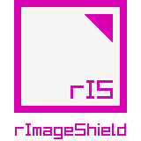</a></td>
            <td style="border: none;">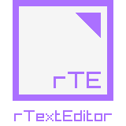</td>
            <td style="border: none;"><a href="https://raylibtech.itch.io/rquizzer">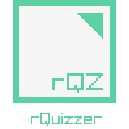</a></td>
            <td style="border: none;"><a href="https://raylibtech.itch.io/riconpacker">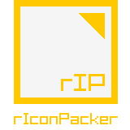</a></td>
            <td style="border: none;"><a href="https://raylibtech.itch.io/rrespacker">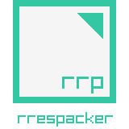</a></td>
        </tr>
        <!-- Row 2 -->
        <tr>
            <td style="border: none;"><a href="https://raylibtech.itch.io/rfxgen">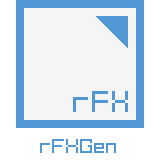</a></td>
            <td style="border: none;"><a href="https://raylibtech.itch.io/rguistyler">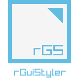</a></td>
            <td style="border: none;"><a href="https://raylibtech.itch.io/rguilayout">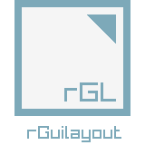</a></td>
            <td style="border: none;"><a href="https://raylibtech.itch.io/rguiicons">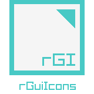</a></td>
            <td style="border: none;"><a href="https://raylibtech.itch.io/rkeygen">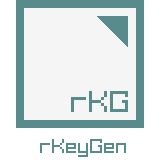</td>
            <td style="border: none;"><a href="https://raylibtech.itch.io/rinstallfriendly">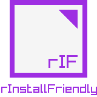</a></td>
            <td style="border: none;">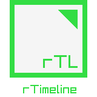</a></td>
            <td style="border: none;">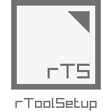</td>
        </tr>
    </tbody>
</table>

## tools description

 - [`rTexViewer`](https://raylibtech.itch.io/rtexviewer): Image viewed with image-board view, image formats optimizer and image shaders editor.
 - [`rTexPacker`](https://raylibtech.itch.io/rtexpacker): Sprites packer and font atlas generation, supporting sprites tags and collisions bound definition.
 - `rFileImager`: Convert any type of file into an image for easy distribution. _NOT RELEASED YET, get in touch for more info_
 - [`rImageShield`](https://raylibtech.itch.io/rimageshield): Steganography tool to embed text messages into images, many configuration options.
 - `rTexEditor`: Small and portable text editor and code editor. _NOT RELEASED YET, get in touch for more info_
 - [`rQuizzer`](https://raylibtech.itch.io/rquizzer): Quizzes creator and player, using simple text files as input data.
 - [`rIconPacker`](https://raylibtech.itch.io/riconpacker): Simple icon packer and extractor, supporting icon-haikus!
 - [`rrespacker`](https://raylibtech.itch.io/rrespacker): Assets packer into `rres` file format, intended for videogames.
 - [`rFXGen`](https://raylibtech.itch.io/rfxgen): Fx sounds generator, 8-bit style sounds (jump, hit, explosion...). This tool is free and open-source.
 - [`rGuiStyler`](https://raylibtech.itch.io/rguistyler): Support tool for [`raygui`](https://github.com/raysan5/raygui), to create custom UI styles to be used on tools development.
 - [`rGuiLayout`](https://raylibtech.itch.io/rguilayout): Support tool for [`raygui`](https://github.com/raysan5/raygui), to define UI layouts to be used on tools development.
 - [`rGuiIcons`](https://raylibtech.itch.io/rguiicons): Support tool for [`raygui`](https://github.com/raysan5/raygui), to create UI 16x16 icons to be used on tools development.
 - [`rKeyGen`](https://raylibtech.itch.io/rkeygen): License keys generator for software products distribution, includes support library `rkls` for integration with custom software.
 - [`rInstallFriendly`](https://raylibtech.itch.io/rinstallfriendly): Software installers creator, with multiple configuration options and simple interface.
 - `rTimeline`: Timelines creator with multiple styling options. _NOT RELEASED YET, get in touch for more info_
 - `rToolSetup`: Tools creator tools, used to accelerate the creation of new tools using some templates. _PRIVATE INTERNAL TOOL_

## more info and contact

You can find more info and follow `raylib technologies` on:

- 🌐 Official Webpage: [raylibtech](https://www.raylibtech.com)
- 🎮 Itch.io store:  [itch.io](https://raylibtech.itch.io/) 
- 💻 Steam store: [Steam](https://store.steampowered.com/developer/raylibtech)
- 🐦 Follow on X: ([@raylibtech](https://x.com/raylibtech))
- 💼 Follow on LinkedIn: [raylibtech](https://www.linkedin.com/company/raylibtech)
- 📧 Questions? Drop a mail: ray@raylibtech.com

